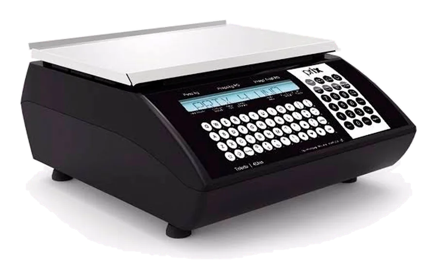

# Linha Verde — guia de componentes (para as páginas iniciais)

Este é o manual da base multipágina **Linha Verde** (`/linha-verde/`). As três páginas iniciais
(`index.html`, `index-2.html`, `index-3.html`) devem usar **exatamente** o cabeçalho, o rodapé,
os arquivos CSS/JS e os componentes descritos aqui, para que as 6 páginas pareçam um só site.

> Regra de ouro: **não edite** `css/base.css`, `css/paginas.css`, `js/core.js` nem as páginas
> dedicadas. Cada variação cria **o seu próprio** CSS/JS (ex.: `css/home-2.css`, `js/home-2.js`)
> e reaproveita o resto. Se precisar de um ajuste global, documente e avise o orquestrador.

---

## 1. Mapa da pasta

```
linha-verde/
  index.html          página inicial PROVISÓRIA (data-variacao="1") — será substituída
  assistencia.html    conserto/manutenção, processo, tipos, IPEM, FAQ do IPEM e da aferição (#faq)
  produtos.html       catálogo completo (#p=ID, ?cat=&sub=&q=) + kits por segmento (#kits)
  sistema.html        BC System (#recursos #fiscal #implantacao), informática (#informatica), BC Fichas (#fichas)
  empresa.html        quem somos, como trabalhamos, equipe (#equipe), clientes/depoimentos (#clientes)
  contato.html        roteador (#ajuda), canais + formulário (#canais), dúvidas (#faq: 1 pergunta própria + atalhos
                      para assistencia.html#faq, sistema.html#fiscal e sistema.html#fichas — cada assunto na sua aba)
  css/base.css        tokens, tipografia, botões, cabeçalho, menu, rodapé, ficha de produto, grade, ticker
  css/paginas.css     hero de página (.phero) e TODOS os blocos de seção (router, IPEM, depoimentos…)
  css/catalogo.css    só produtos.html
  css/assistencia.css só assistencia.html (linha do processo, tipos, antes→depois)
  js/core.js          núcleo (dados, menu, fichas, animações) — window.LV
  js/catalogo.js      só produtos.html
  js/assistencia.js   só assistencia.html
  js/preview.js       seletor de variação (fase de escolha; remover na publicação)
  img/                logo-512.png, og-*.jpg, clientes/qualidade.webp, miniaturas de 480 px (WebP q82):
                      p480/r/*.webp (de compartilhado/img/produtos-recorte) e p480/f/*.webp (de compartilhado/img/produtos)
```

Links internos úteis para as páginas iniciais:
`assistencia.html`, `assistencia.html#ipem`, `produtos.html`, `produtos.html?cat=balancas`,
`produtos.html#p=toledo-prix-4-uno`, `produtos.html#kits`, `sistema.html`, `sistema.html#fiscal`,
`sistema.html#fichas`, `sistema.html#informatica`, `empresa.html`, `empresa.html#equipe`,
`empresa.html#clientes`, `contato.html`, `contato.html#canais`, `contato.html#faq`.

---

## 2. Esqueleto de uma página inicial

**O jeito mais rápido:** copie `index.html` (já tem `<head>`, sprite, cabeçalho, rodapé e scripts)
e troque só o `<main>`. Ajuste:

1. `<body class="pg-inicio" data-variacao="2">` → `1`, `2` ou `3` (obrigatório: liga o seletor de variação).
2. `<link rel="stylesheet" href="css/home-N.css">` depois de `paginas.css` (se tiver CSS próprio).
3. `<script defer src="js/home-N.js"></script>` **depois** de `core.js` e **antes** dos scripts do CDN.
4. Se usar `Flip` ou `DrawSVGPlugin`, acrescente o `<script defer>` do CDN correspondente (abaixo).
5. `canonical` das três variações: `https://balancass.com/` (são alternativas da mesma página).
6. **Um único `<h1>`** na página. Conteúdo visível sem JS (nunca esconda só por CSS).
7. Troque o `<link rel="preload" as="image">` pela imagem principal do SEU hero (ou apague-o). `title`/`description`/OG/JSON-LD (`ElectronicsStore`) do `index.html` já servem para as três variações.

### 2.1 `<head>` completo (copiar)

```html
<!doctype html>
<html lang="pt-BR">
<head>
<meta charset="utf-8">
<meta name="viewport" content="width=device-width, initial-scale=1, viewport-fit=cover">
<title>Balanças e Automação Comercial em Rio Claro-SP | Balanças.com</title>
<meta name="description" content="Conserto de balanças (oficina autorizada pelo IPEM-SP), balanças Toledo e Balmak, PDV, etiquetadoras e o BC System com NFC-e. Atendimento em Rio Claro e região.">
<meta name="theme-color" content="#0A0A0A">
<link rel="canonical" href="https://balancass.com/">
<meta property="og:type" content="website">
<meta property="og:locale" content="pt_BR">
<meta property="og:site_name" content="Balanças.com">
<meta property="og:title" content="Balanças.com — A medida certa para o seu negócio">
<meta property="og:description" content="Assistência técnica de balanças, equipamentos de automação comercial e o BC System com NFC-e. Rio Claro-SP, desde 2010.">
<meta property="og:url" content="https://balancass.com/">
<meta property="og:image" content="https://balancass.com/img/og-linha-verde.jpg">
<meta property="og:image:type" content="image/jpeg">
<meta property="og:image:width" content="1200">
<meta property="og:image:height" content="630">
<meta property="og:image:alt" content="Balança Toledo Prix 4 Uno sobre a faixa verde da Balanças.com, com o texto Pesa. Imprime. Vende.">
<meta name="twitter:card" content="summary_large_image">
<meta name="twitter:title" content="Balanças.com — A medida certa para o seu negócio">
<meta name="twitter:description" content="Assistência técnica de balanças, equipamentos de automação comercial e o BC System com NFC-e. Rio Claro-SP, desde 2010.">
<meta name="twitter:image" content="https://balancass.com/img/og-linha-verde.jpg">
<link rel="icon" href="../compartilhado/img/logo/balancas-icone.svg" type="image/svg+xml">
<link rel="apple-touch-icon" href="img/logo-512.png">
<link rel="preconnect" href="https://fonts.googleapis.com">
<link rel="preconnect" href="https://fonts.gstatic.com" crossorigin>
<link rel="preconnect" href="https://cdn.jsdelivr.net">
<link rel="stylesheet" href="https://fonts.googleapis.com/css2?family=Big+Shoulders:opsz,wght@10..72,700..900&family=Archivo:wdth,wght@62..125,400..800&family=Martian+Mono:wght@400..500&display=swap">
<link rel="stylesheet" href="css/base.css">
<link rel="stylesheet" href="css/paginas.css">
<link rel="stylesheet" href="css/home-N.css">  <!-- CSS próprio da variação (opcional) -->
<link rel="preload" as="image" href="../compartilhado/img/produtos-recorte/prix4uno.webp" fetchpriority="high">
<script>
  /* Marca o documento antes de pintar: as animações de entrada só escondem
     o conteúdo enquanto o JS não assume. Se algo falhar, tudo reaparece. */
  (function (d, w) {
    d.className += " js is-loading";
    /* Rede lenta (GSAP do CDN atrasado): aos 2,6 s o conteúdo aparece sozinho e fica marcado
       "lv-late" (+ "via-vt"): quando o GSAP chegar, nada do que já está na tela some para
       animar de novo e as aberturas vão direto ao fim. lv-tarde/LV_LIBEROU = nomes antigos. */
    setTimeout(function () {
      if (!d.classList.contains("is-loading")) return;
      d.classList.add("lv-late", "lv-tarde", "via-vt"); d.classList.remove("is-loading"); w.LV_LIBEROU = true;
    }, 2600);
    /* Chegou pela transição diagonal entre páginas: o destino aparece pronto.
       LV_REVELOU: o 1º quadro já saiu (o js/core.js usa para evitar corridas). */
    addEventListener("pagereveal", function (e) { w.LV_REVELOU = true; if (e.viewTransition) d.classList.add("via-vt"); });
  })(document.documentElement, window);
</script>
<noscript><style>.burger{display:none}@media(max-width:1080px){.nav{display:block;position:absolute;top:100%;left:0;right:0;margin:0;background:#0A0A0A;border-bottom:1px solid #1E1E1D}.nav__list{overflow-x:auto;padding-inline:var(--gut)}.nav__list li{flex:none}main{padding-top:44px}}</style></noscript>
<script type="application/ld+json">
{
 "@context": "https://schema.org",
 "@type": "ElectronicsStore",
 "@id": "https://balancass.com/#loja",
 "name": "Balanças.com — Automação Comercial",
 "alternateName": "Balanças.com",
 "slogan": "A medida certa para o seu negócio",
 "description": "Assistência técnica de balanças (oficina autorizada pelo IPEM-SP), venda de balanças e equipamentos de automação comercial, BC System (PDV com NFC-e e NF-e) e locação de terminais de fichas para eventos, em Rio Claro-SP.",
 "url": "https://balancass.com/",
 "logo": "https://balancass.com/img/logo-512.png",
 "image": "https://balancass.com/img/og-linha-verde.jpg",
 "telephone": "+55-19-3023-9050",
 "email": "balancas.com@gmail.com",
 "priceRange": "$$",
 "foundingDate": "2010",
 "founder": {
  "@type": "Person",
  "name": "Fábio Godoy"
 },
 "legalName": "Fabio de Godoy Lima Ltda",
 "taxID": "12.403.843/0001-18",
 "address": {
  "@type": "PostalAddress",
  "streetAddress": "Rua 13, 650 - Boa Morte (entre as Avenidas 9 e 11)",
  "addressLocality": "Rio Claro",
  "addressRegion": "SP",
  "postalCode": "13500-120",
  "addressCountry": "BR"
 },
 "hasMap": "https://maps.google.com/?cid=12422356528564941318",
 "openingHoursSpecification": [
  {
   "@type": "OpeningHoursSpecification",
   "dayOfWeek": [
    "Monday",
    "Tuesday",
    "Wednesday",
    "Thursday",
    "Friday"
   ],
   "opens": "08:00",
   "closes": "11:00"
  },
  {
   "@type": "OpeningHoursSpecification",
   "dayOfWeek": [
    "Monday",
    "Tuesday",
    "Wednesday",
    "Thursday",
    "Friday"
   ],
   "opens": "13:00",
   "closes": "18:00"
  },
  {
   "@type": "OpeningHoursSpecification",
   "dayOfWeek": "Saturday",
   "opens": "08:00",
   "closes": "12:00"
  }
 ],
 "areaServed": [
  "Rio Claro",
  "Região de Rio Claro-SP"
 ],
 "contactPoint": {
  "@type": "ContactPoint",
  "telephone": "+55-19-3023-9050",
  "contactType": "customer service",
  "availableLanguage": "pt-BR"
 },
 "sameAs": [
  "https://www.facebook.com/balancas.comrc/",
  "https://maps.google.com/?cid=12422356528564941318"
 ]
}
</script>
<!-- Scripts locais primeiro (dados, fichas e links funcionam enquanto o CDN carrega); depois GSAP/Lenis -->
<script defer src="../compartilhado/dados/empresa.js"></script>
<script defer src="../compartilhado/dados/produtos.js"></script>
<script defer src="../compartilhado/js/balancas.js"></script>
<script defer src="js/core.js"></script>
<script defer src="js/home-N.js"></script>  <!-- JS próprio da variação (opcional) -->
<script defer src="js/preview.js"></script>
<script defer src="https://cdn.jsdelivr.net/npm/gsap@3.15.0/dist/gsap.min.js"></script>
<script defer src="https://cdn.jsdelivr.net/npm/gsap@3.15.0/dist/ScrollTrigger.min.js"></script>
<script defer src="https://cdn.jsdelivr.net/npm/gsap@3.15.0/dist/SplitText.min.js"></script>
<script defer src="https://cdn.jsdelivr.net/npm/lenis@1.3.26/dist/lenis.min.js"></script>
</head>
<body class="pg-inicio" data-variacao="N">  <!-- N = 1, 2 ou 3 -->
```

Scripts do CDN disponíveis (todos `defer`, sempre DEPOIS dos locais):

```html
<script defer src="https://cdn.jsdelivr.net/npm/gsap@3.15.0/dist/gsap.min.js"></script>
<script defer src="https://cdn.jsdelivr.net/npm/gsap@3.15.0/dist/ScrollTrigger.min.js"></script>
<script defer src="https://cdn.jsdelivr.net/npm/gsap@3.15.0/dist/SplitText.min.js"></script>
<script defer src="https://cdn.jsdelivr.net/npm/gsap@3.15.0/dist/Flip.min.js"></script>          <!-- opcional -->
<script defer src="https://cdn.jsdelivr.net/npm/gsap@3.15.0/dist/DrawSVGPlugin.min.js"></script> <!-- opcional -->
<script defer src="https://cdn.jsdelivr.net/npm/lenis@1.3.26/dist/lenis.min.js"></script>
```

Ordem obrigatória: `empresa.js` → `produtos.js` → `balancas.js` → `core.js` → (`home-N.js`) → `preview.js` → CDN.
Nada de `type="module"` nem `fetch` (o site precisa abrir por `file://`).

### 2.2 Sprite de ícones (logo of + ícones) — primeiro filho do `<body>`

```html
<svg class="sprite" width="0" height="0" aria-hidden="true" focusable="false">
  <defs>
    <path id="lv-b" d="M -30 -91.2 L -30 0 A 30 30 0 0 0 26 15 L 26 56.3 A 62 62 0 0 1 -62 0 L -62 -73.3 A 96 96 0 0 1 -30 -91.2 Z"/>
    <path id="lv-q" d="M 30 91.2 L 30 0 A 30 30 0 0 0 -26 -15 L -26 -56.3 A 62 62 0 0 1 62 0 L 62 73.3 A 96 96 0 0 1 30 91.2 Z"/>
    <mask id="lv-m" maskUnits="userSpaceOnUse" x="-100" y="-100" width="200" height="200"><rect x="-100" y="-100" width="200" height="200" fill="#fff"/><circle r="34" fill="#000"/><use href="#lv-b" fill="#000" stroke="#000" stroke-width="8" stroke-linejoin="round"/><use href="#lv-q" fill="#000" stroke="#000" stroke-width="8" stroke-linejoin="round"/></mask>
    <symbol id="lv-logo" viewBox="-100 -100 200 200"><circle r="100" fill="currentColor" mask="url(#lv-m)"/><use href="#lv-b" fill="#019F42"/><use href="#lv-q" fill="#019F42"/></symbol>
    <symbol id="i-wa" viewBox="0 0 24 24"><path fill="currentColor" d="M17.472 14.382c-.297-.149-1.758-.867-2.03-.967-.273-.099-.471-.148-.67.15-.197.297-.767.966-.94 1.164-.173.199-.347.223-.644.075-.297-.15-1.255-.463-2.39-1.475-.883-.788-1.48-1.761-1.653-2.059-.173-.297-.018-.458.13-.606.134-.133.298-.347.446-.52.149-.174.198-.298.298-.497.099-.198.05-.371-.025-.52-.075-.149-.669-1.612-.916-2.207-.242-.579-.487-.5-.669-.51-.173-.008-.371-.01-.57-.01-.198 0-.52.074-.792.372-.272.297-1.04 1.016-1.04 2.479 0 1.462 1.065 2.875 1.213 3.074.149.198 2.096 3.2 5.077 4.487.709.306 1.262.489 1.694.625.712.227 1.36.195 1.871.118.571-.085 1.758-.719 2.006-1.413.248-.694.248-1.289.173-1.413-.074-.124-.272-.198-.57-.347m-5.421 7.403h-.004a9.87 9.87 0 0 1-5.031-1.378l-.361-.214-3.741.982.998-3.648-.235-.374a9.86 9.86 0 0 1-1.51-5.26c.001-5.45 4.436-9.884 9.888-9.884 2.64 0 5.122 1.03 6.988 2.898a9.825 9.825 0 0 1 2.893 6.994c-.003 5.45-4.437 9.884-9.885 9.884m8.413-18.297A11.815 11.815 0 0 0 12.05 0C5.495 0 .16 5.335.157 11.892c0 2.096.547 4.142 1.588 5.945L.057 24l6.305-1.654a11.882 11.882 0 0 0 5.683 1.448h.005c6.554 0 11.89-5.335 11.893-11.893a11.821 11.821 0 0 0-3.48-8.413Z"/></symbol>
    <symbol id="i-phone" viewBox="0 0 24 24"><path fill="currentColor" d="M6.6 10.8c1.4 2.8 3.8 5.1 6.6 6.6l2.2-2.2c.3-.3.7-.4 1-.2 1.1.4 2.3.6 3.6.6.6 0 1 .4 1 1V20c0 .6-.4 1-1 1C10.6 21 3 13.4 3 4c0-.6.4-1 1-1h3.5c.6 0 1 .4 1 1 0 1.3.2 2.5.6 3.6.1.3 0 .7-.2 1L6.6 10.8z"/></symbol>
    <symbol id="i-arrow" viewBox="0 0 24 24"><path fill="none" stroke="currentColor" stroke-width="2" stroke-linecap="square" d="M4 12h15M13 6l6 6-6 6"/></symbol>
    <symbol id="i-out" viewBox="0 0 24 24"><path fill="none" stroke="currentColor" stroke-width="2" stroke-linecap="square" d="M7 17 17 7M9 7h8v8"/></symbol>
    <symbol id="i-star" viewBox="0 0 24 24"><path fill="currentColor" d="m12 2.6 2.8 6.1 6.6.7-5 4.5 1.4 6.5L12 17.1l-5.8 3.3 1.4-6.5-5-4.5 6.6-.7z"/></symbol>
    <symbol id="i-wrench" viewBox="0 0 24 24"><path fill="none" stroke="currentColor" stroke-width="1.6" stroke-linejoin="round" d="M14.7 6.3a1 1 0 0 0 0 1.4l1.6 1.6a1 1 0 0 0 1.4 0l3.77-3.77a6 6 0 0 1-7.94 7.94l-6.91 6.91a2.12 2.12 0 0 1-3-3l6.91-6.91a6 6 0 0 1 7.94-7.94l-3.76 3.76z"/></symbol>
    <symbol id="i-box" viewBox="0 0 24 24"><path fill="none" stroke="currentColor" stroke-width="1.6" stroke-linejoin="round" d="M21 16V8a2 2 0 0 0-1-1.73l-7-4a2 2 0 0 0-2 0l-7 4A2 2 0 0 0 3 8v8a2 2 0 0 0 1 1.73l7 4a2 2 0 0 0 2 0l7-4A2 2 0 0 0 21 16zM3.3 7 12 12l8.7-5M12 22V12M7.5 4.5l9 5.2"/></symbol>
    <symbol id="i-receipt" viewBox="0 0 24 24"><path fill="none" stroke="currentColor" stroke-width="1.6" stroke-linejoin="round" d="M5 2.5h14v19l-2.4-1.6-2.3 1.6-2.3-1.6-2.3 1.6-2.3-1.6L5 21.5zM8.5 7h7M8.5 10.5h7M8.5 14h4.5"/></symbol>
    <symbol id="i-ticket" viewBox="0 0 24 24"><path fill="none" stroke="currentColor" stroke-width="1.6" stroke-linejoin="round" d="M2.5 5.5h19v4a2.5 2.5 0 0 0 0 5v4h-19v-4a2.5 2.5 0 0 0 0-5zM15 6v2M15 11v2M15 16v2"/></symbol>
    <symbol id="i-scale" viewBox="0 0 24 24"><path fill="none" stroke="currentColor" stroke-width="1.6" stroke-linejoin="round" d="M3.5 20.5h17M5 20.5l1.6-6h10.8l1.6 6M8.5 14.5v-4h7v4M4 7.5h16M12 3.5v7M6.5 7.5l-2 4h4zM17.5 7.5l-2 4h4z"/></symbol>
    <symbol id="i-monitor" viewBox="0 0 24 24"><path fill="none" stroke="currentColor" stroke-width="1.6" stroke-linejoin="round" d="M3 4.5h18v12H3zM8.5 20.5h7M12 16.5v4"/></symbol>
    <symbol id="i-check" viewBox="0 0 24 24"><path fill="none" stroke="currentColor" stroke-width="2.6" stroke-linecap="square" d="M5 12.5l4.5 4.5L19 7.5"/></symbol>
    <symbol id="i-clock" viewBox="0 0 24 24"><circle cx="12" cy="12" r="8.5" fill="none" stroke="currentColor" stroke-width="1.6"/><path fill="none" stroke="currentColor" stroke-width="1.6" stroke-linecap="square" d="M12 7.5V12l3 2"/></symbol>
    <symbol id="i-pin" viewBox="0 0 24 24"><path fill="none" stroke="currentColor" stroke-width="1.6" d="M12 21s-7-6.2-7-11.5a7 7 0 0 1 14 0C19 14.8 12 21 12 21z"/><circle cx="12" cy="9.5" r="2.5" fill="none" stroke="currentColor" stroke-width="1.6"/></symbol>
    <symbol id="i-mail" viewBox="0 0 24 24"><path fill="none" stroke="currentColor" stroke-width="1.6" d="M3 5.5h18v13H3zM3.5 6l8.5 7 8.5-7"/></symbol>
    <symbol id="i-fb" viewBox="0 0 24 24"><path fill="currentColor" d="M13.5 21v-7.5h2.6l.4-3h-3V8.6c0-.9.3-1.5 1.5-1.5h1.6V4.4c-.3 0-1.2-.1-2.3-.1-2.3 0-3.9 1.4-3.9 4v2.2H7.8v3h2.6V21z"/></symbol>
    <symbol id="i-search" viewBox="0 0 24 24"><path fill="none" stroke="currentColor" stroke-width="2" d="M10.5 18a7.5 7.5 0 1 0 0-15 7.5 7.5 0 0 0 0 15zM16 16l5.5 5.5"/></symbol>
    <symbol id="i-link" viewBox="0 0 24 24"><path fill="none" stroke="currentColor" stroke-width="2" d="M10 14a4.5 4.5 0 0 0 6.4 0l3.2-3.2a4.5 4.5 0 0 0-6.4-6.4L12 5.6M14 10a4.5 4.5 0 0 0-6.4 0l-3.2 3.2a4.5 4.5 0 0 0 6.4 6.4l1.2-1.2"/></symbol>
    <symbol id="i-pause" viewBox="0 0 24 24"><path fill="currentColor" d="M7 5h3.5v14H7zM13.5 5H17v14h-3.5z"/></symbol>
    <symbol id="i-play" viewBox="0 0 24 24"><path fill="currentColor" d="M7 4.5v15l12-7.5z"/></symbol>
  </defs>
</svg>
```

Uso: `<svg class="i" aria-hidden="true"><use href="#i-wa"/></svg>`.
Ícones: `i-wa i-phone i-arrow i-out i-star i-wrench i-box i-receipt i-ticket i-scale i-monitor i-check i-clock i-pin i-mail i-fb i-search i-link i-pause i-play`.
Logo: `<svg class="logo__icon"><use href="#lv-logo"/></svg>` (o anel usa `currentColor`; o "bq" é sempre verde).

### 2.3 Cabeçalho + menu mobile (copiar exatamente)

Na página inicial o link **Início** leva `aria-current="page"` (como abaixo). Nas outras páginas o
`aria-current` vai no link da própria página. Todo link para a home tem o atributo **`data-home`**
(logo do cabeçalho, "Início" do menu, do menu mobile, do rodapé e da trilha "Início /").

```html
<a class="skip" href="#conteudo">Pular para o conteúdo</a>

<header class="hdr" data-hdr>
  <div class="hdr__in">
    <a class="logo" href="index.html" data-home aria-label="Balanças.com — página inicial">
      <svg class="logo__icon" aria-hidden="true"><use href="#lv-logo"/></svg>
      <span class="logo__txt"><span class="logo__name">Balanças<span class="logo__dot">.</span>com</span><span class="logo__tag">Automação comercial</span></span>
    </a>
    <nav class="nav" aria-label="Menu principal">
      <ul class="nav__list">
        <li><a class="nav__a" href="index.html" data-home aria-current="page"><span class="st" data-t="Início">Início</span></a></li>
        <li><a class="nav__a" href="assistencia.html"><span class="st" data-t="Assistência">Assistência</span></a></li>
        <li><a class="nav__a" href="produtos.html"><span class="st" data-t="Produtos">Produtos</span></a></li>
        <li><a class="nav__a" href="sistema.html"><span class="st" data-t="BC System">BC System</span></a></li>
        <li><a class="nav__a" href="empresa.html"><span class="st" data-t="Empresa">Empresa</span></a></li>
        <li><a class="nav__a" href="contato.html"><span class="st" data-t="Contato">Contato</span></a></li>
      </ul>
    </nav>
    <a class="btn btn--green btn--sm hdr__wa" data-wa="" href="https://wa.me/551930239050?text=Ol%C3%A1%21%20Vim%20pelo%20site%20da%20Balan%C3%A7as.com%20e%20gostaria%20de%20atendimento." target="_blank" rel="noopener"><svg class="i" aria-hidden="true"><use href="#i-wa"/></svg><span class="st" data-t="WhatsApp">WhatsApp</span></a>
    <button class="burger" type="button" aria-expanded="false" aria-controls="menu" data-burger>
      <span class="burger__l" aria-hidden="true"></span><span class="burger__l" aria-hidden="true"></span>
      <span class="sr-only" data-burger-label>Abrir menu</span>
    </button>
  </div>
  <span class="hdr__progress" aria-hidden="true"></span>
</header>

<div class="menu" id="menu" role="dialog" aria-modal="true" aria-label="Menu" data-menu hidden>
  <div class="menu__band" aria-hidden="true"></div>
  <nav class="menu__nav" aria-label="Menu">
    <ol class="menu__list">
      <li><a href="index.html" data-home aria-current="page"><span class="mono">01</span>Início</a></li>
      <li><a href="assistencia.html"><span class="mono">02</span>Assistência</a></li>
      <li><a href="produtos.html"><span class="mono">03</span>Produtos</a></li>
      <li><a href="sistema.html"><span class="mono">04</span>BC System</a></li>
      <li><a href="empresa.html"><span class="mono">05</span>Empresa</a></li>
      <li><a href="contato.html"><span class="mono">06</span>Contato</a></li>
    </ol>
  </nav>
  <div class="menu__foot">
    <a class="btn btn--green" data-wa="" href="https://wa.me/551930239050?text=Ol%C3%A1%21%20Vim%20pelo%20site%20da%20Balan%C3%A7as.com%20e%20gostaria%20de%20atendimento." target="_blank" rel="noopener"><svg class="i" aria-hidden="true"><use href="#i-wa"/></svg><span class="st" data-t="Falar no WhatsApp">Falar no WhatsApp</span></a>
    <p class="mono menu__info"><span class="nobr" data-bc="telefone">(19) 3023-9050</span> · <span class="nobr">Rio Claro-SP</span></p>
  </div>
</div>
```

### 2.4 Rodapé + botões flutuantes (copiar exatamente)

```html
<footer class="ftr">
  <div class="wrap">
    <p class="ftr__giant" aria-hidden="true">Balanças<span>.</span>com</p>
    <div class="ftr__grid">
      <div class="ftr__brand">
        <a class="logo" href="index.html" data-home aria-label="Balanças.com — página inicial">
          <svg class="logo__icon" aria-hidden="true"><use href="#lv-logo"/></svg>
          <span class="logo__txt"><span class="logo__name">Balanças<span class="logo__dot">.</span>com</span><span class="logo__tag">Automação comercial</span></span>
        </a>
        <p class="ftr__phrase">A medida certa para o seu negócio.</p>
      </div>
      <nav class="ftr__col" aria-label="Rodapé">
        <p class="ftr__h mono">Navegação</p>
        <ul role="list"><li><a href="index.html" data-home aria-current="page">Início</a></li><li><a href="assistencia.html">Assistência técnica</a></li><li><a href="produtos.html">Produtos</a></li><li><a href="sistema.html">BC System</a></li><li><a href="sistema.html#fichas">BC Fichas</a></li><li><a href="empresa.html">Empresa</a></li><li><a href="contato.html">Contato</a></li><li><a href="contato.html#faq">Perguntas frequentes</a></li></ul>
      </nav>
      <div class="ftr__col">
        <p class="ftr__h mono">Contato</p>
        <ul role="list">
          <li><a data-wa="" href="https://wa.me/551930239050?text=Ol%C3%A1%21%20Vim%20pelo%20site%20da%20Balan%C3%A7as.com%20e%20gostaria%20de%20atendimento." target="_blank" rel="noopener">WhatsApp <span data-bc="telefone">(19) 3023-9050</span></a></li>
          <li><a data-bc-href="email" href="mailto:balancas.com@gmail.com"><span data-bc="email">balancas.com@gmail.com</span></a></li>
          <li><a data-bc-href="mapa" href="https://maps.google.com/?cid=12422356528564941318" target="_blank" rel="noopener"><span data-bc="endereco">Rua 13, 650 – Boa Morte, <span class="nobr">Rio Claro/SP</span> · <span class="nobr">CEP 13500-120</span></span><br><span class="ftr__ref" data-bc="referencia">Entre as Avenidas 9 e 11</span></a></li>
          <li><a data-bc-href="facebook" href="https://www.facebook.com/balancas.comrc/" target="_blank" rel="noopener">Facebook</a></li>
        </ul>
      </div>
      <div class="ftr__col">
        <p class="ftr__h mono">Horários</p>
        <p class="ftr__status"><span class="status" data-bc="status" data-curto hidden></span></p>
        <ul class="hours hours--ftr" role="list" data-bc-list="horarios"><li><span>Segunda a sexta</span><span>8h às 11h · 13h às 18h</span></li><li><span>Sábado</span><span>8h às 12h</span></li><li><span>Domingo e feriados</span><span>Fechado</span></li></ul>
      </div>
    </div>
    <div class="ftr__legal mono">
      <p>© <span data-bc="ano">2026</span> <span data-bc="razao">Fabio de Godoy Lima Ltda</span><span class="ftr__sep"> · </span><span class="nobr">CNPJ <span data-bc="cnpj">12.403.843/0001-18</span></span></p>
      <p><span data-bc="ipem">Oficina autorizada pelo <span class="nobr">IPEM-SP</span></span><span class="ftr__sep"> · </span><span class="nobr">Rio Claro-SP</span></p>
    </div>
  </div>
</footer>

<aside class="float is-hidden" data-float aria-label="Atalhos de contato">
  <a class="float__b float__b--tel" data-bc-href="tel" href="tel:+551930239050" aria-label="Ligar para a Balanças.com"><svg class="i" aria-hidden="true"><use href="#i-phone"/></svg></a>
  <a class="float__b float__b--wa" data-wa="" href="https://wa.me/551930239050?text=Ol%C3%A1%21%20Vim%20pelo%20site%20da%20Balan%C3%A7as.com%20e%20gostaria%20de%20atendimento." target="_blank" rel="noopener" aria-label="Conversar no WhatsApp"><svg class="i" aria-hidden="true"><use href="#i-wa"/></svg></a>
</aside>
```

O rodapé tem o wordmark gigante, Navegação/Contato/Horários (com o status "Aberto agora") e a barra legal.
Não mude a ordem nem os textos. O `<aside class="float">` (WhatsApp + Ligar no celular) vem logo depois.

---

## 3. Tokens (css/base.css → `:root`)

| Token | Valor | Uso |
|---|---|---|
| `--ink` | `#0A0A0A` | fundo preto, texto sobre claro |
| `--ink-2` / `--ink-3` | `#131313` / `#1B1B1A` | cartões sobre preto |
| `--paper` | `#F4F4F0` | off-white (fundo claro, texto sobre preto) |
| `--paper-2` / `--paper-3` | `#EAEAE4` / `#DCDCD5` | tons de apoio claros |
| `--green` | `#019F42` | verde da marca: faixas, fundos, ícones, textos GRANDES (≥24px) |
| `--green-deep` | `#007A35` | texto/link verde sobre fundo claro (contraste AA) |
| `--volt` | `#C6FF3D` | **só** em etiquetas pequenas (`.tag--volt`), números de callout, foco |
| `--line` | `#494949` | fios técnicos (nunca texto sobre preto) |
| `--grey` | `#8A8A85` | texto secundário sobre preto |
| `--muted` | `#55554F` | texto secundário sobre claro |
| `--body-dark` / `--body-paper` | `#CFCFC9` / `#2A2A28` | parágrafos sobre preto / sobre claro |
| `--slash` / `--tan` | `-12deg` / `0.2126` | **o único ângulo do site** (skewX) |
| `--f-display` | Big Shoulders 700–900 | títulos condensados, sempre MAIÚSCULAS |
| `--f-text` | Archivo (eixo de largura 62–125) | texto corrido, botões |
| `--f-mono` | Martian Mono | rótulos, números técnicos, kicker (11px, maiúsculas) |
| `--hdr` | 72px (62px ≤760px) | altura do cabeçalho fixo |
| `--gut` | `clamp(16px, 4.2vw, 64px)` | margem lateral (16px no celular) |
| `--max` | 1520px | largura máxima do conteúdo (`.wrap`) |
| `--sec-pad` | `clamp(88px, 10vw, 160px)` | respiro vertical das seções |
| `--ease` / `--ease-out` | `cubic-bezier(.7,0,.2,1)` / `cubic-bezier(.16,1,.3,1)` | transições CSS |

Botão verde: **texto preto sobre verde**. Nunca texto verde `#019F42` pequeno sobre fundo claro.
Z-index: skip 200 · painel do catálogo 150 · cabeçalho 100 · menu 99 · flutuantes 90 · seletor de variação 89.

---

## 4. Classes utilitárias e componentes básicos (base.css)

| Classe | O que faz |
|---|---|
| `.wrap` | container centralizado (`--max` + `--gut`) |
| `.on-dark` / `.on-paper` / `.on-green` | tema da seção (fundo, cor, `--bg`, cores de botões e foco se ajustam sozinhas) |
| `.sec` (+ `.sec--first`, `.sec--tight`) | seção com respiro padrão; `--first` = primeira seção logo após uma faixa |
| `.sec__tab` | aba numerada que "sai" da seção: `<div class="sec__tab" aria-hidden="true"><b>01</b><span>/04 · Nome</span></div>` |
| `.sec__head` + `--split` | cabeçalho de seção (título à esquerda, `.sec__intro` à direita) |
| `.kicker` | rótulo mono com barrinha verde inclinada antes |
| `.h2` (`.h2--md`, `.h2--sm`), `.h3` | títulos Big Shoulders maiúsculos |
| `.lead`, `.prose`, `.note` | parágrafo de destaque, texto corrido, nota com fio verde |
| `.mono` | texto Martian Mono 11px maiúsculo |
| `.tag .tag--volt / --green / --ink / --line` | etiqueta inclinada |
| `.btn .btn--green / --ink / --line` (+ `--sm`, `--lg`) | botão com pontas cortadas a −12°; `.btns` agrupa (recuo −6px) |
| `.st` + `data-t` | texto que "estica" no hover: `<span class="st" data-t="Ver produtos">Ver produtos</span>` (use dentro de botões/links) |
| `.link-u`, `.link-out` | link sublinhado / link com seta ↗ |
| `.chips` | lista de chips mono (`<ul class="chips" role="list"><li>…`) |
| `.giant` (+ `--outline`, `--solid`, `--top`, `--mid`, `--bottom`) | palavra gigante decorativa (`aria-hidden`, use `data-drift`) |
| `.crop .crop--tl / --br` | marcas de corte gráficas |
| `.crumbs` | trilha "Início / Página" (sobre fundo escuro) |
| `.slash` | barrinha verde inclinada inline |
| `.status` | ponto + "Aberto agora / Fechado agora" (preenchido por `data-bc="status"`) |
| `.mt-1…5`, `.mb-1…3` | margens utilitárias |
| `.nobr`, `.sr-only` | sem quebra / só leitor de tela |
| `.ticker` (+ `.ticker--ink`) | faixa corrida (ver §7) |
| `.spec`, `.pgrid` | ficha de produto e grade (ver §6) |

---

## 5. Dados da empresa no HTML (`data-bc`)

O HTML **sempre** traz o texto/URL real (SEO e sem JS); o `core.js` reescreve a partir de
`compartilhado/dados/empresa.js`. Nunca escreva telefone/endereço sem o atributo.

**Textos — `data-bc="chave"`:** `telefone`, `email`, `endereco` (Rua 13, 650 – Boa Morte, Rio Claro/SP · CEP 13500-120),
`referencia` (Entre as Avenidas 9 e 11), `rua`, `bairro`, `cidade`, `cep`, `ipem` (Oficina autorizada pelo IPEM-SP),
`cnpj`, `razao`, `frase`, `desde` (2010), `experiencia` (25), `ano` (ano atual), `anos` (anos desde 2010),
`google-nota` (5,0), `google-qtd` (56), `total-produtos`, `total-categorias`, `total-marcas`,
`status` (Aberto/Fechado agora · fecha/abre às…; use `hidden` no HTML e `data-curto` para só "Aberto agora").

**Links — `data-bc-href="chave"`:** `whatsapp`, `tel`, `email`, `mapa`, `google`, `facebook`, `bcfichas`.
**WhatsApp com mensagem pronta:** `<a data-wa="Olá! Vim pelo site e quero…" href="https://wa.me/551930239050?text=…" target="_blank" rel="noopener">` (vazio = mensagem padrão). O core põe `target`, `rel` e o aviso "(abre em nova aba)".

**Listas — `data-bc-list="…"`:** `horarios` (`<ul class="hours">`), `marcas` (`<ul class="ticker__list">`),
`clientes` (`<ul class="clients__list">`), `depoimentos` (`<ul class="quotes__list">`, aceita `data-limite="3"` e `data-inicio="3"`),
`equipe` (`<ul class="team__list">`, monogramas). Escreva os itens também no HTML (copie de `empresa.html`).

Exemplos:
```html
<a data-bc-href="tel" href="tel:+551930239050">Ligar <span data-bc="telefone">(19) 3023-9050</span></a>
<p><span class="status" data-bc="status" hidden></span></p>
<a data-bc-href="google" href="https://maps.google.com/?cid=12422356528564941318" target="_blank" rel="noopener"><b data-bc="google-nota">5,0</b> no Google (<span data-bc="google-qtd">56</span> avaliações)</a>
```

---

## 6. Produtos: `LV.cardProduto` e `data-produtos`

### Declarativo (recomendado)
```html
<ul class="pgrid pgrid--4" role="list" data-produtos="destaques" data-limite="4">
  <li><a class="link-u" href="produtos.html">Ver o catálogo completo</a></li>  <!-- reserva sem JS: é substituída -->
</ul>
```
- `data-produtos`: `"destaques"` (os 10 com `destaque: true`), `"todos"`, `"cat:balancas"`, `"cat:automacao"`, `"cat:informatica"`, `"sub:Checkout"` ou ids separados por vírgula (`"toledo-prix-4-uno,elgin-l42-pro,balmak-w300"`).
- `data-limite="4"` · `data-variante="ficha|compacta|escura"` · `data-linhas="2"` (linhas da tabela) · `data-resumo="nao"` · `data-eager` (sem lazy) · `data-sem-reveal`.
- Grade `.pgrid` (auto-fill ~292px), `.pgrid--4`, `.pgrid--3`. **No celular (<640px) vira 2 colunas compactas** automaticamente.

### Imperativo
```js
LV.cardProduto(p | "id", { n, variante: "ficha"|"compacta"|"escura", linhas: 3, resumo: true, h: "h3", detalhe: "produtos.html", eager: false, sizes, classe })
// → string HTML de <article class="spec">: aba da categoria, Nº, foto em palco com grade, marca, modelo,
//   resumo, tabela técnica, selo "Consulte disponibilidade", preço "Consulte", botões Detalhes e WhatsApp.
LV.listaProdutos(lista, opts)  // → "<li class='pgrid__i'>…</li>" × n
LV.produtos("destaques")       // → array de produtos (mesmos seletores de data-produtos)
LV.imgProduto(p, { eager, sizes, alt })  // →  com srcset da miniatura de 480px (img/p480/r/ ou, sem recorte, img/p480/f/)
LV.spec(p, "capacidade")       // → valor de uma especificação
```
- Fora do catálogo, **Detalhes** abre `produtos.html#p=ID` (painel com ficha completa, WhatsApp, Ligar, Copiar link).
- Sempre `BC.escape()`/`LV.esc()` ao montar HTML com dados.
- Fotos para heros/composições: `../compartilhado/img/produtos-recorte/*.webp` (PNG transparente refeito com IA).
  Produtos pretos (prix4uno, prix5, balmak, balmak-orion2, elgin-i9, epson-t20, el4200, l42pro, zebra, centrium-pc, tl900, menno, w300) ficam ótimos sobre preto/verde;
  brancos/inox (9094plus, hospitalar, bk200f, 2098, 8217, prix3plus) → use sobre fundo claro ou o "palco" da ficha.
- Estoque: todos "Consulte disponibilidade". Preço vazio → "Consulte". Nada de preço inventado.

---

## 7. Blocos prontos (css/paginas.css) — onde copiar o HTML

| Bloco | Classe | Copiar de | Fundo |
|---|---|---|---|
| Hero de página (título em linhas com barra verde, faixa diagonal, figura, callouts) | `.phero` (+ `--short`, `--min`; `.phero__t--xl/--md`) | qualquer página dedicada | preto |
| Faixa de confiança (rodapé do hero) | `.phero__strip > .trust` | `assistencia.html` | preto |
| Faixa corrida verde | `.ticker[data-ticker][data-skew]` | `assistencia.html` | verde |
| Faixa de marcas | `.ticker[data-bc-list="marcas"]` dentro de `.brands` | `empresa.html` | verde/preto (`.ticker--ink`) |
| Roteador "Como podemos ajudar?" (4 lâminas → WhatsApp) | `.router` | `contato.html#ajuda` | claro ou escuro |
| Linhas de serviço com foto | `.svc` | (ver CSS; padrão do Design 3) | escuro |
| Recursos do BC System (tabela + molduras) | `.bcs`, `.spec-table`, `.bcs__frame` | `sistema.html#recursos` | claro |
| SAT → NFC-e ("Ainda no SAT? Regularize já.") | `.sat[data-sat]` | `sistema.html#fiscal` | qualquer |
| Checklist NFC-e | `.check` | `sistema.html#fiscal` | escuro/claro |
| Passos numerados | `.steps` | `sistema.html#implantacao` | claro/escuro |
| Bloco IPEM (fatos + multas + carimbo) | `.ipem`, `.facts`, `.ipem__cta`, `.stamp[data-stamp]` | `assistencia.html#ipem` | verde |
| Nota Google + depoimentos | `.proof`, `.gscore`, `.quotes__list`, `.quote` | `empresa.html#clientes` | escuro/claro |
| Logos de clientes (em cor) | `.clients` | `empresa.html#clientes` | escuro/claro |
| Números (2010 → hoje, 25+ anos, 5,0) | `.deltas`, `.delta` | `empresa.html#quem-somos` | claro/escuro |
| Como trabalhamos | `.values`, `.value` | `empresa.html#como-trabalhamos` | escuro |
| Equipe (monogramas) | `.team__list`, `.member` | `empresa.html#equipe` | claro/escuro |
| Kits por segmento (abas + produtos) | `.kits[data-kits]` | `produtos.html#kits` | escuro |
| BC Fichas (fichas impressas) | `.fichas`, `.ficha` | `sistema.html#fichas` | verde |
| Informática | `.info` | `sistema.html#informatica` | escuro |
| FAQ (acordeão acessível) | `.faq`, `.acc[data-acc]` (item com `aria-expanded="true"` + `.acc__p.is-open` já vem aberto) | `assistencia.html#faq` | claro |
| Contato + formulário → WhatsApp | `.contact`, `.form[data-form]` | `contato.html#canais` | escuro |
| Faixa final de chamada | `.ask.on-dark / .on-green / .on-paper` | fim das páginas dedicadas | — |

Ids únicos: ao copiar acordeão, kits ou carimbo, troque os `id`/`aria-controls` (ex.: `faq-1` → `hfaq-1`, `stamp-top-ipem` → `stamp-top-home`).
A página inicial é um **resumo**: escolha poucos blocos e linke para as páginas dedicadas (não copie seções inteiras).

### Hero de página (estrutura mínima)
```html
<section class="phero" aria-labelledby="phero-t">
  <div class="phero__grid" aria-hidden="true"></div>
  <div class="wrap phero__in">
    <div class="phero__copy">
      <h1 class="phero__t" id="phero-t">
        <span class="phero__l"><span class="phero__w" data-intro>Pesa.</span><span class="phero__bar" aria-hidden="true"></span></span>
        <span class="phero__l phero__l--green"><span class="phero__w" data-intro>Vende.</span><span class="phero__bar" aria-hidden="true"></span></span>
      </h1>
      <p class="phero__lead" data-intro><strong>Frase forte.</strong> Texto de apoio.</p>
      <div class="btns phero__ctas" data-intro data-float-off> …botões… </div>
    </div>
    <div class="phero__visual">
      <div class="phero__band" aria-hidden="true"></div>
      <figure class="phero__fig"></figure>
      <p class="phero__call phero__call--1 mono" aria-hidden="true"><b>01</b> Rótulo técnico</p>
    </div>
  </div>
</section>
```
O `core.js` anima sozinho qualquer `.phero` (faixa desce, barras verdes revelam as linhas, figura sobe).
Para um hero **próprio** da variação, use outras classes e anime no seu `LV.onMotion` (ver §8).

### Linha de serviço (`.svc`, fundo escuro) — exemplo
```html
<ol class="svc" role="list">
  <li class="svc__row" data-reveal>
    <span class="svc__n mono">01</span>
    <h3 class="svc__t">Assistência técnica de balanças</h3>
    <div class="svc__body">
      <p>Manutenção preventiva e corretiva, troca de peças, lacre e regularização junto ao <span class="nobr">IPEM-SP</span>.</p>
      <ul class="chips" role="list"><li>Preventiva</li><li>Corretiva</li><li>Lacre</li></ul>
      <a class="link-out mono" href="assistencia.html">Como funciona <svg class="i" aria-hidden="true"><use href="#i-arrow"/></svg></a>
    </div>
    <figure class="svc__fig" data-reveal="mask"></figure>
  </li>
</ol>
```
Fotos de serviço em `compartilhado/img/fotos/` são pequenas (360×250): use-as pequenas. Boas fotos grandes: `fotos/kit-pdv.webp`, `fotos/prix-6-pdv.webp` (transparente), `fotos/capa-industrial.webp`, `sistema/bc-system-tablet-celular.webp`, `sistema/bc-system-pdv-tablet.webp` (não use imagens com "CF-e SAT": `bc-system-composicao.webp`, `impressora-fiscal.webp`).

---

## 8. Movimento: `data-reveal`, `data-intro` e `LV.onMotion`

**Regras (obrigatórias):** só `transform`/`opacity`/`clip-path`; conteúdo visível **sem JS**
(o estado escondido é aplicado pelo JS na hora de animar); `prefers-reduced-motion: reduce` = tudo
aparece direto, sem Lenis; efeitos de cursor só em `(hover: hover) and (pointer: fine)`; faixas com
pausa no hover e botão de pausa; nada de animação infinita chamativa.

### Revelação por rolagem (`data-reveal`)
| Valor | Efeito |
|---|---|
| `data-reveal` (vazio) | sobe 40px e aparece (em lote, com stagger) |
| `data-reveal="left"` / `"right"` / `"scale"` | entra da esquerda / direita / cresce de 92% |
| `data-reveal="stagger"` | os **filhos** entram um a um (listas, grades) |
| `data-reveal="split"` | título: linhas sobem inclinadas a −12° e se endireitam (SplitText) |
| `data-reveal="mask"` | figura abre num paralelogramo a partir da barra diagonal (+ zoom da imagem) |
| `data-reveal="wipe"` | barra verde atravessa o elemento e o revela (`data-reveal-cor="ink|paper|green"`) |

Extras: `data-reveal-delay="0.2"`, `data-reveal-start="top 80%"`.

### Outros atributos animados pelo core
- `data-intro` — entrada do topo da página: escondido enquanto `html.is-loading` (só com JS e sem movimento reduzido); o `<head>` libera sozinho após 2,6 s (e marca `lv-late`).
  **Exceção: os botões do topo (`.btns[data-intro]`)** não esperam o GSAP — o `base.css` os faz entrar por animação CSS
  desde o 1º quadro (visíveis em < 1 s, em todas as páginas). Essa animação prevalece sobre o estilo inline do GSAP:
  não inclua `.btns` nas timelines de abertura (se incluir, não tem efeito visível).
- `data-drift` — palavra gigante atravessa com a rolagem · `data-parallax="-12"` — paralaxe vertical (yPercent).
- `data-count` (inteiro), `data-count-from="2010"`, `data-count-dec` (5,0) — contador quando entra na tela.
- `data-magnet` — botão magnético (mouse) · `data-tilt` — inclinação 3D com o mouse (área = seção pai).
- `data-ticker` (+ `data-skew`, `data-speed="0.6"`) — faixa corrida; `data-sat` — animação SAT→NFC-e; `data-stamp` — carimbo "bate" na página.
- `data-float-off` — enquanto o bloco está na tela, os botões flutuantes somem (use nos CTAs do hero e em blocos com WhatsApp).
- `data-acc` — acordeão; `data-form` — formulário que monta a mensagem do WhatsApp; `data-kits` — abas de kits.

### API JS (`window.LV`, disponível depois do `core.js`)
```js
LV.onMotion(function (mm) {            // roda dentro do gsap.matchMedia "sem movimento reduzido",
  var tl = gsap.timeline();            // DEPOIS que "is-loading" saiu e antes de pintar (sem piscar).
  LV.wipe(document.querySelector(".meu-titulo"), { tl: tl, at: 0.2, cor: "green" });
  tl.from(".minha-figura", { yPercent: 12, autoAlpha: 0, duration: 1.2, ease: "expo.out" }, 0.5);
  gsap.from(".x", { opacity: 0, y: 30, scrollTrigger: LV.st(".x", "top 85%") });
});
LV.pronto()          // o topo deve aparecer TERMINADO (chegou pela transição "via-vt" ou o GSAP chegou tarde "lv-late"): use tl.progress(1)
LV.aoRevelar(fn)     // fn() roda se o "pagereveal" de uma transição entre páginas ainda chegar (ex.: () => tl.progress(1))
LV.jaVisivel(el)     // el está na tela e JÁ foi visto (quadro pintado antes do GSAP, âncora, recarregar no meio,
                     // transição, GSAP tardio) → NÃO esconda para animar. O core já respeita isso em data-reveal,
                     // contadores, abas .sec__tab, SAT e carimbo; use nos seus ganchos também.
LV.tarde()           // a rede de segurança do <head> já mostrou a página (html.lv-late)
LV.motionOK()        // GSAP carregado e sem movimento reduzido
LV.reduzido()        // usuário pediu menos movimento
LV.reveal(els, dur)  // revela um lote (o que já ficou para trás aparece direto)
LV.wipe(el, opts)    // barra verde revela o elemento (cria .lv-wipe se não houver)
LV.st(trigger, start)// config de ScrollTrigger "once" (padrão "top 88%")
LV.refresh()         // ScrollTrigger.refresh()
LV.irPara("#id")     // rolagem suave até a âncora (respeita cabeçalho + aba da seção)
                     // Chegada por pagina.html#id: o core.js rola com a mesma conta e, até a pessoa rolar
                     // ou tocar na página, realinha o alvo quando as fontes chegam e no "load" (a página
                     // encolhe ~1000 px com as fontes da web). Não role para o hash por conta própria.
LV.statusAgora()     // { aberto, curto, texto } no horário de Rio Claro (considera LV.FERIADOS: nacionais + SP;
                     // feriados MUNICIPAIS de Rio Claro → o dono acrescenta em FERIADOS.MUNICIPAIS no js/core.js)
LV.nomeHTML(nome)    // nome do modelo para títulos display: não quebra no hífen nem deixa "7" sozinho
LV.lenis, LV.mm      // instância do Lenis e o gsap.matchMedia
LV.hdr(), LV.esc(s), LV.pad(n), LV.catCurto(cat), LV.inertBg(on), LV.fecharMenu()
```
Elementos que **você** esconder para animar devem ter `data-intro` (topo) ou ser escondidos via `gsap.set`
dentro do `LV.onMotion` — nunca por CSS puro. Para heros próprios, se quiser o estado inicial já no
primeiro quadro, use `.is-loading .minha-classe { opacity: 0 }` dentro de
`@media (prefers-reduced-motion: no-preference)` (o core tira `is-loading` antes de chamar os ganchos).
Âncoras `href="#id"` na mesma página já rolam suave com compensação do cabeçalho (`scroll-margin-top` das `.sec`).

---

## 9. Pré-visualização das variações (`js/preview.js`)

- `<body data-variacao="1|2|3">` → grava `"lv-home"` = `index.html` / `index-2.html` / `index-3.html` em **localStorage**
  (vale para links abertos em nova aba) e em sessionStorage (reserva se o localStorage estiver bloqueado). Leitura: a
  escolha desta aba (sessionStorage) e, se não houver, a última escolha (localStorage).
- Seletor: no computador, **"Variação 1 · 2 · 3"** no canto inferior esquerdo; no celular (≤ 760 px), só uma pílula
  **"V1"** (alvo de 44 px) que abre as opções ao tocar e fecha ao tocar fora, com Esc ou ao rolar — não cobre o
  conteúdo nem os flutuantes de WhatsApp/Ligar (testado em 360 e 390 px); no topo da página fica escondida e aparece ao rolar. Classe `.lvp`, atributo `data-preview`.
- Em todas as páginas, os links com `data-home` passam a apontar para a variação guardada (padrão `index.html`).
- Incluir `<script defer src="js/preview.js"></script>` em todas as páginas. **Remover na publicação.**

---

## 10. Conteúdo: o que pode e o que não pode (resumo do briefing)

- Pode: "A medida certa para o seu negócio" · desde 2010 · fundador Fábio Godoy, 25+ anos · **Oficina autorizada pelo IPEM-SP** ·
  5,0 no Google com 56 avaliações · Rio Claro e região · Rua 13, 650 – entre as Avenidas 9 e 11 – Boa Morte ·
  seg–sex 8h–11h e 13h–18h, sáb 8h–12h · "Trabalhamos com as marcas…" · depoimentos reais de `EMPRESA.depoimentos`.
- Não pode: "calibração"/"verificação feita por nós" (diga manutenção, conserto, regularização, "pronta para a verificação do IPEM");
  "líder", "menor preço", "todo o estado", "assistência/revenda autorizada Toledo/Balmak…"; número de autorização do IPEM;
  número de clientes; Instagram; vender SAT (em SP o CF-e SAT está proibido desde 01/01/2026 → "Ainda no SAT? Regularize já");
  "100% pronto" para a Reforma Tributária (diga "acompanhamos de perto"); preços inventados; "Consolação"; "Av. 12, 1313".
- Português do Brasil impecável, frases curtas, tom próximo.

---

## 11. QA antes de entregar

```bash
S=/tmp/claude-0/-home-user-Site-Balancass/e3cfd0be-da03-5694-a886-3b18478ba333/scratchpad
node $S/qa.mjs file:///home/user/Site-Balancass/linha-verde/index-2.html $S/qa/home-2/full-1440.png 1440 900
node $S/qa.mjs file:///home/user/Site-Balancass/linha-verde/index-2.html $S/qa/home-2/full-390.png 390 844
node $S/qa.mjs file:///home/user/Site-Balancass/linha-verde/index-2.html $S/qa/home-2/full-360.png 360 740
node $S/vshot.mjs file:///home/user/Site-Balancass/linha-verde/index-2.html $S/qa/home-2/v 390 844 0,1,2 1
```
Zero erros de console, zero rolagem horizontal (o `.sec` corta o que vaza com `overflow-x: clip`; confira nos
screenshots se nada importante foi cortado), um `<h1>`, seletor de variação visível e com a sua variação destacada,
"Início" voltando para a sua variação, tudo visível com `reducedMotion: "reduce"` e sem JavaScript.
O screenshot de página inteira distorce alturas em `vh` (hero): avalie o topo com `vshot.mjs`.
